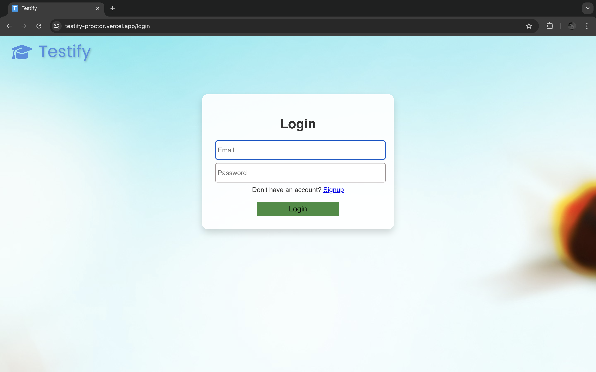
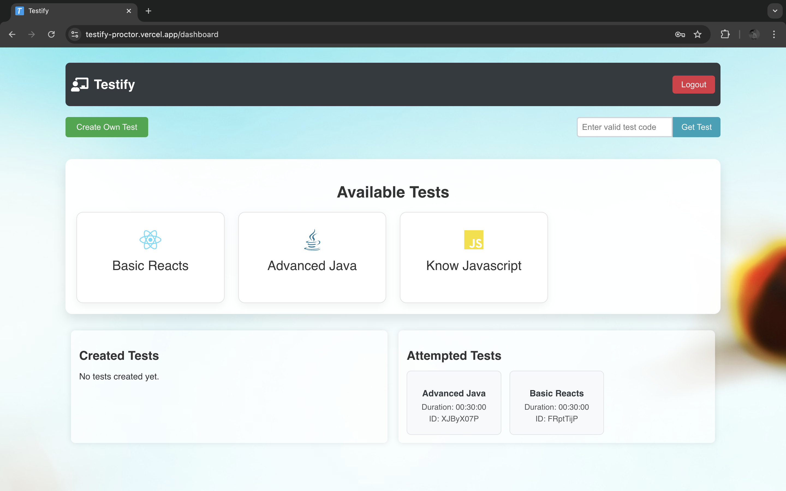
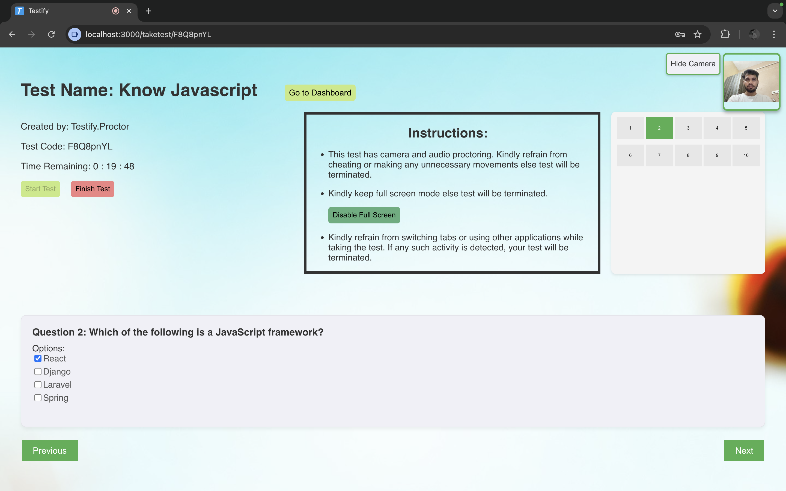
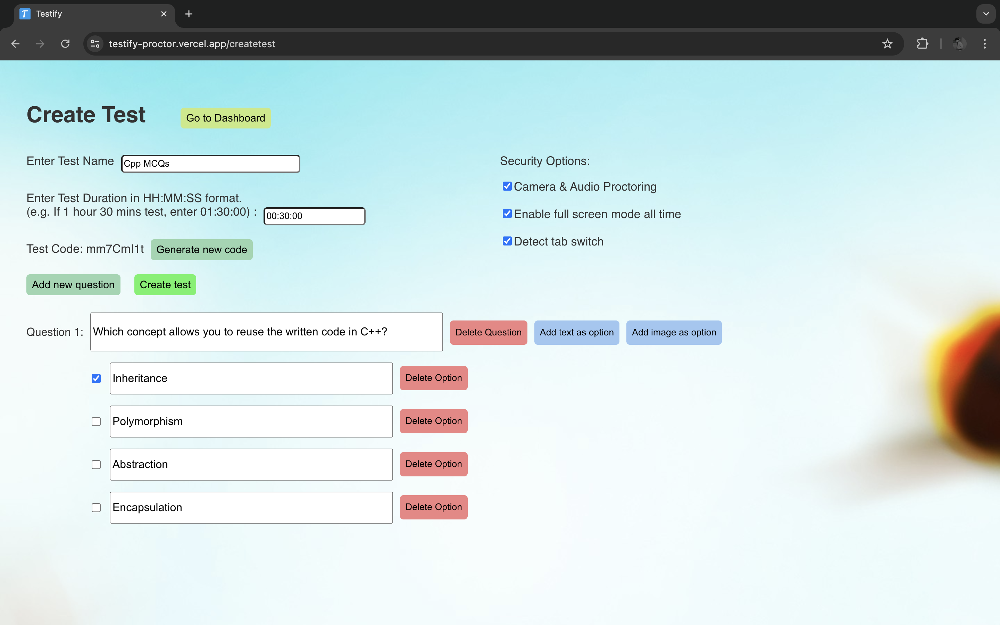
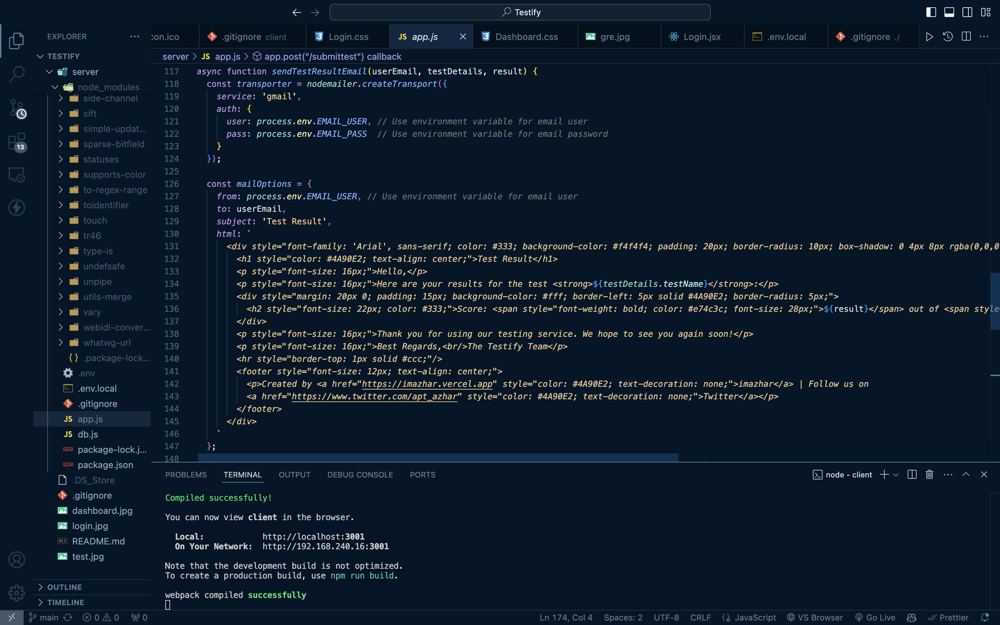
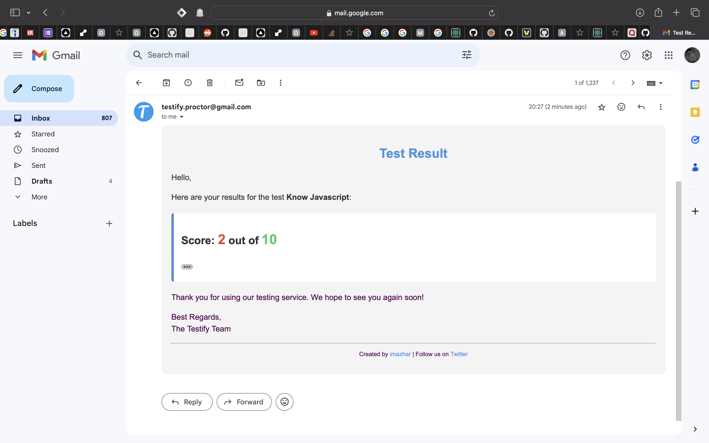

# Testify - Online Testing Platform

Testify is a comprehensive online testing platform designed to streamline the process of conducting and managing online exams. It provides robust features for creating, administering, and monitoring tests, ensuring a secure and efficient testing environment for both educators and students.

[Self Hosted Link: Testify](https://testify-proctor.vercel.app)

### **⚠️ WARNING: Please wait for 50 seconds while logging in, as the server is running on a free instance, which requires time to start.**

## Key Features

- **Test Creation:** Educators can easily create tests, specifying test names, durations, and questions.
- **Test Taking:** Students can take tests in a controlled environment with features like proctoring and full-screen mode enforcement.
- **Results Management:** Automatic grading and instant result generation with detailed feedback.
- **Security Measures:** Proctoring features to prevent cheating, tab-switching detection, and full-screen mode requirements.
- **Email Notifications:** Automated email notifications to students with detailed test results.

## Unique Features

### Security and Proctoring
- **Camera and Audio Monitoring:** Ensures that the test environment is secure by accessing the candidate's microphone and camera to deter and detect any suspicious activities.
- **Full-Screen Mode Requirement:** Testify requires that the test be taken in full-screen mode to minimize distractions and prevent users from accessing other resources.
- **Tab Switch Detection:** The platform can detect if a user switches tabs during the test, which will lead to automatic termination of the test to prevent cheating.

### Test Management
- **Custom Test Creation:** Educators can create customized tests with unique questions and specific configurations including time limits, question order randomization, and more.
- **Dynamic Test Taking Interface:** Provides a user-friendly interface for test-taking, including time tracking, instant feedback, and a visually appealing layout.
- **Automated Result Processing:** Results are processed automatically and can be viewed immediately after test completion. Detailed feedback is provided to help students understand their performance.

### Accessibility and Integration
- **Responsive Design:** Ensures that the platform is accessible on various devices, including tablets and smartphones, making it easy to take tests on the go.
- **Integration with Educational Tools:** Testify can be integrated with other educational tools and platforms to provide a seamless experience for both students and educators.

### Additional Features
- **Real-Time Notifications:** Users receive real-time notification results through email.
- **Analytics and Reporting:** Advanced analytics for tracking performance and detailed reports are generated for each test, which can be exported for further analysis.

## Screenshots

### Login Page

*Built with React.js and integrated with Auth0 for secure authentication.*

### Dashboard

*The dashboard allows users to navigate through tests and view available and completed tests. Built using React.js and styled with CSS.*

### Test Interface

*This interface shows the live test environment, which includes security features like camera monitoring and tab detection.*

### Create Your Own Test

*This screenshot demonstrates the process of creating a custom test, where educators can specify the test name, set time limits, choose questions, and configure other settings.*

### Result Email Template

*Customizable email template for sending test results, using Nodemailer for email delivery.*

### Result Email Screenshot

*Example of an actual email received by a student, showing personalized test results.*

## Technical Stack

- **Frontend:** Developed using React.js for dynamic user interfaces, with state management via React Hooks.
- **Backend:** Node.js with Express for RESTful API services, and MongoDB for database management.
- **Authentication:** Utilizes JWT for secure token-based user authentication.
- **Email Service:** Implements Nodemailer for sending automated emails, configured to use Gmail as the service provider.

## Sample Credentials

- **Email:** Testify@gmail.com
- **Password:** Testify@99

## Created by

[imazhar](https://imazhar.vercel.app) ❤️
